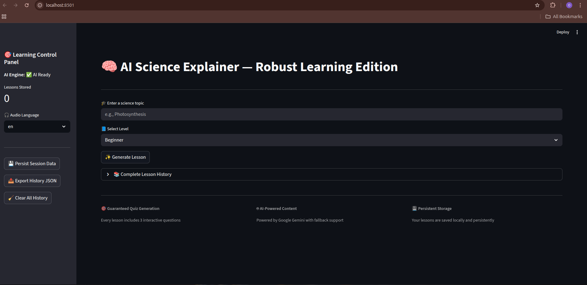
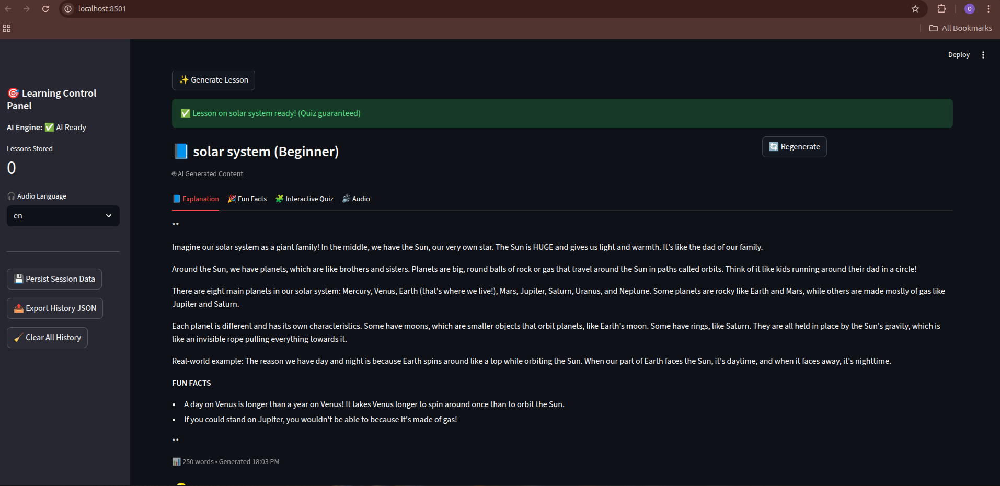
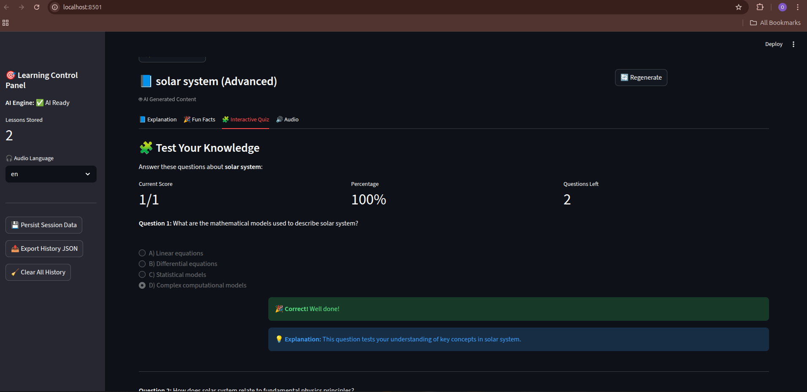
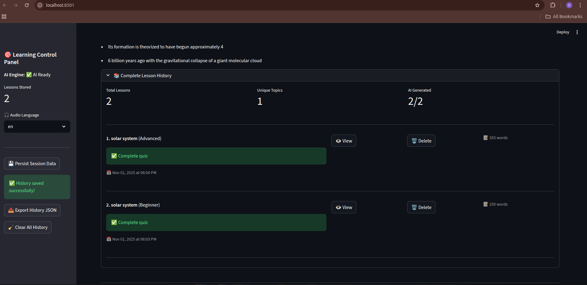
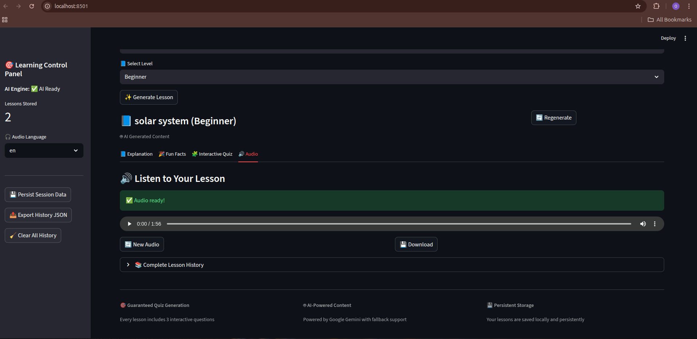

# 🧠 AI Science Explainer

> An intelligent science education platform that generates personalized lessons with AI-powered explanations, interactive quizzes, and audio narration for enhanced learning experiences.


## About

The **AI Science Explainer** is a comprehensive educational tool designed to make complex scientific concepts accessible to learners at all levels. Powered by **Google Gemini AI**, it creates customized lessons with guaranteed quiz components and persistent learning history.

### ✨ Key Capabilities
- 🎯 **Personalized Learning**: Content adapts to your skill level (**Beginner**, **Intermediate**, **Advanced**)
- 📊 **Interactive Assessment**: Real-time quiz scoring with detailed feedback
- 🎵 **Multi-modal Learning**: Text, audio, and visual elements for enhanced comprehension
- 📈 **Persistent Progress**: Track your learning journey with detailed history
- 🔄 **Offline Access**: Download audio lessons for learning on-the-go

## 🌟 Features

- 🤖 **AI-powered lesson generation** using **Google Gemini**
- 📚 **Adaptive learning levels** (**Beginner**/**Intermediate**/**Advanced**)
- 🧩 **Interactive quizzes** with real-time scoring
- 🔊 **Audio narration** with multi-language support
- 💾 **Persistent lesson history** tracking
- 🎨 **Clean, intuitive interface** for seamless learning

## 🚀 Quick Start

### � Clone this repo

You can clone this repository locally using one of the following commands:

HTTPS:

```bash
git clone https://github.com/Oliver9105/science-concept-explainer.git
```

SSH:

```bash
git clone git@github.com:Oliver9105/science-concept-explainer.git
```

If you prefer, you can also download the repository as a ZIP from GitHub.

If you're deploying to Streamlit Cloud, make sure the repo is public or grant Streamlit access to the private repo when connecting the app.

### �📋 Prerequisites
- **Python 3.8+**
- **Google API key**

### 📦 Installation

```bash
pip install streamlit google-generativeai gtts python-dotenv
```

### ⚙️ Setup

1. **Create `.env` file:**
```env
GOOGLE_API_KEY=your_api_key_here
```

2. **Run the app:**
```bash
streamlit run app.py
```

> 🎉 **That's it!** Your AI Science Explainer is ready to use.

## 📖 Usage

### Getting Started

1. **Enter a science topic** in the input field
2. **Select difficulty level** (**Beginner**, **Intermediate**, or **Advanced**)
3. **Click "Generate Lesson"** to create your personalized content
4. **Navigate through the tabs** to explore different features:

   - 📝 **Explanation**: Main lesson content with detailed explanations
   - 🔬 **Fun Facts**: Interesting discoveries and trivia
   - 🧩 **Quiz**: Interactive questions with real-time scoring
   - 🔊 **Audio**: Text-to-speech playback for audio learners

## 📁 Project Structure

```
📦 AI Science Explainer
├── 🐍 app.py              # **Main Streamlit application** - Core application logic
├── 📋 requirements.txt    # **Python dependencies** - Required packages list
├── 🔐 .env               # **Environment variables** (create manually)
├── 📊 lessons.json       # **Lesson history** (generated automatically)
├── 📚 README.md          # **This documentation** - User guide and setup
└── 📸 screenshots/       # **Application screenshots** - Visual documentation
    ├── 🖼️ main_interface.png
    ├── 🖼️ lesson_generation.png
    ├── 🖼️ quiz_interface.png
    └── 🖼️ lesson_history.png
    ├── 🖼️ audio_interface.png
```

## 🔑 API Configuration

To enable **AI-powered lesson generation**, you need a **Google API key**:

1. **Set your Google API key** in the `.env` file:
```env
GOOGLE_API_KEY=your_google_api_key
```

> ⚠️ **Important**: Never commit your `.env` file to version control to protect your API credentials.

## 📸 Screenshots

### 🏠 Main Interface

*Clean, intuitive interface for entering science topics and selecting learning levels*

### 📚 Lesson Generation

*AI-generated lesson content with detailed explanations, fun facts, and interactive quizzes*

### 🧩 Interactive Quiz

*Real-time scoring and detailed feedback for enhanced learning assessment*

### 📊 Lesson History

*Complete learning journey tracking with statistics and progress monitoring*

### 🔊 Audio lesson generation
 
*listen to your lesson*   

## 📜 License

### **MIT License**


**copyright (c) 2025 Oliver9105**

Permission is hereby granted, free of charge, to any person obtaining a copy
of this software and associated documentation files (the "Software"), to deal
in the Software without restriction, including without limitation the rights
to use, copy, modify, merge, publish, distribute, sublicense, and/or sell
copies of the Software, and to permit persons to whom the Software is
furnished to do so, subject to the following conditions:

The above copyright notice and this permission notice shall be included in all
copies or substantial portions of the Software.

THE SOFTWARE IS PROVIDED "AS IS", WITHOUT WARRANTY OF ANY KIND, EXPRESS OR
IMPLIED, INCLUDING BUT NOT LIMITED TO THE WARRANTIES OF MERCHANTABILITY,
FITNESS FOR A PARTICULAR PURPOSE AND NONINFRINGEMENT. IN NO EVENT SHALL THE
AUTHORS OR COPYRIGHT HOLDERS BE LIABLE FOR ANY CLAIM, DAMAGES OR OTHER
LIABILITY, WHETHER IN AN ACTION OF CONTRACT, TORT OR OTHERWISE, ARISING FROM,
OUT OF OR IN CONNECTION WITH THE SOFTWARE OR THE USE OR OTHER DEALINGS IN THE
SOFTWARE.
